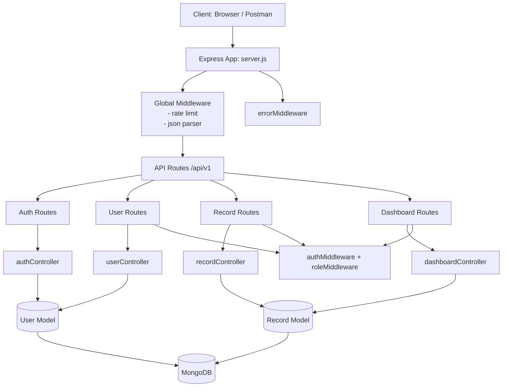

# Finance Dashboard Backend


- GitHub Repo: [https://github.com/shubh100802/Finance-Dashboard-Backend.git](https://github.com/shubh100802/Finance-Dashboard-Backend.git)
- Deployed API: [https://finance-dashboard-backend-yw1h.onrender.com](https://finance-dashboard-backend-yw1h.onrender.com)

A secure, role-aware backend API for managing financial records and powering dashboard analytics. It enables teams to track income and expenses, enforce access policies, and expose clean reporting endpoints for frontend dashboards. The project focuses on practical backend architecture with authentication, RBAC, validation, and production-minded protections.

## Features
- JWT authentication (register/login with token-based access)
- Role-based access control (`admin`, `analyst`, `viewer`)
- Financial records CRUD with filtering and pagination
- Dashboard analytics APIs (summary, category totals, monthly trends)
- Input validation and centralized error handling
- Global rate limiting for API protection

## Tech Stack
- Node.js
- Express.js
- MongoDB with Mongoose
- JWT (`jsonwebtoken`)
- bcrypt
- express-rate-limit
- dotenv

## Architecture

### High-Level Flow
```text
Client (Web App / Postman)
        |
        v
Express Server (server.js)
  - Rate Limiter
  - JSON Parser
  - Route Mounting (/api/v1)
        |
        v
Middleware Layer
  - authMiddleware (JWT + active user check)
  - roleMiddleware (RBAC)
  - errorMiddleware (centralized errors)
        |
        v
Controller Layer
  - authController
  - userController
  - recordController
  - dashboardController
        |
        v
Mongoose Models
  - User
  - Record
        |
        v
MongoDB
```

### Architecture Diagram (Mermaid)


## Setup

### 1) Install Dependencies
```bash
npm install
```

### 2) Create Environment File
```bash
copy .env.example .env
```

### 3) Start Server
```bash
npm start
```

## Environment Variables
```env
PORT=5000
MONGO_URI=mongodb://127.0.0.1:27017/finance_dashboard
JWT_SECRET=your_secret_here
JWT_EXPIRES_IN=1d
```

## API Base URL
```text
http://localhost:5000/api/v1
```

## API Endpoints

### Auth
```http
POST /api/v1/auth/register
POST /api/v1/auth/login
```

### User Management (Admin Only)
```http
GET   /api/v1/users
PATCH /api/v1/users/:id/role
PATCH /api/v1/users/:id/status
```

### Financial Records
```http
POST   /api/v1/records
GET    /api/v1/records
PUT    /api/v1/records/:id
DELETE /api/v1/records/:id
```

### GET /api/v1/records Query Params
```text
page      (default: 1)
limit     (default: 10, max: 100)
type      (income | expense)
category  (string)
startDate (ISO date)
endDate   (ISO date)
```

### Dashboard Analytics (Admin, Analyst)
```http
GET /api/v1/dashboard/summary
GET /api/v1/dashboard/category
GET /api/v1/dashboard/trends
```

## Sample API Response
Example: `GET /api/v1/dashboard/summary`

```json
{
  "success": true,
  "data": {
    "totalIncome": 50000,
    "totalExpense": 30000,
    "netBalance": 20000
  }
}
```

## Admin Bootstrap (First Time)
Registration always creates `viewer` users. To create the first admin, register once and then promote that user directly in MongoDB:

```javascript
use finance_dashboard
db.users.updateOne(
  { email: "admin@example.com" },
  { $set: { role: "admin" } }
)
```

After that, use:

```http
PATCH /api/v1/users/:id/role
```

## Postman
Import:

```text
FinanceDashboard.postman_collection.json
```

